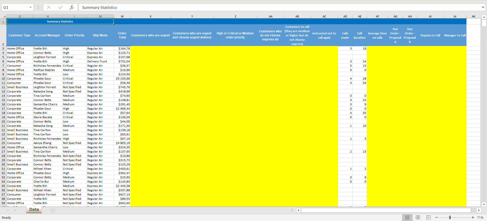
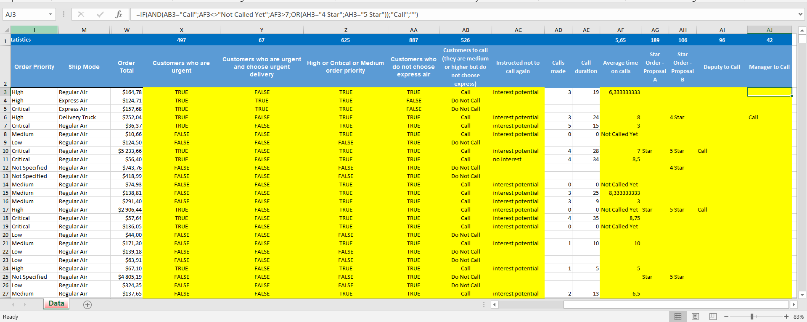
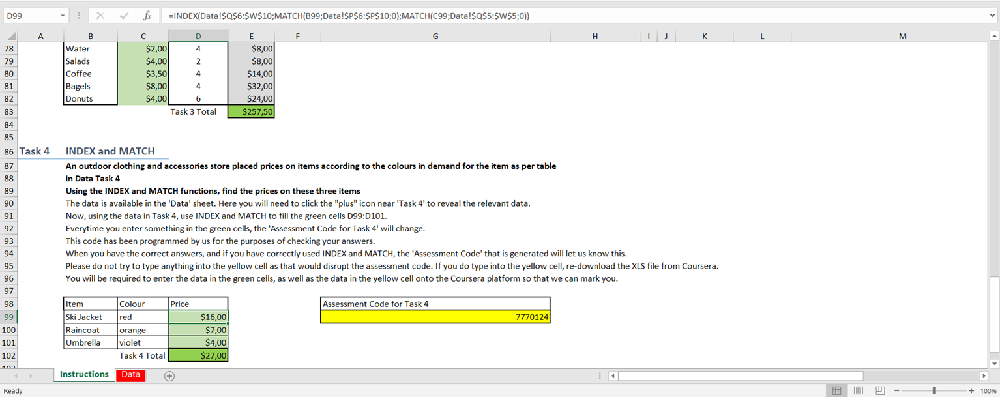
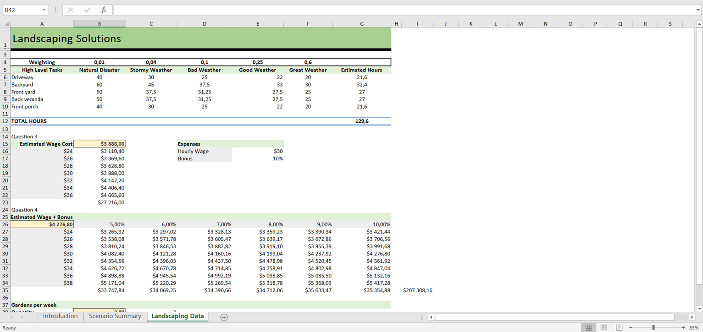
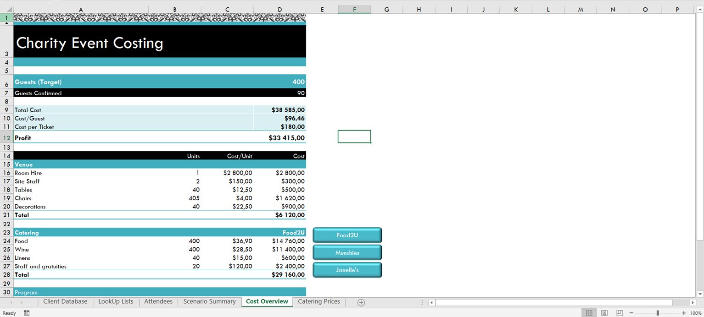

## Course Information

- Course: Excel Skills for Business: Intermediate II
- Platform: Coursera
- Started: 2026-06-03
- Status: In Progress

## 2026-06-07 | C3-W2-Final-Assessment
  
- Completed Week 2 final assessment.
  
### Skills Used:

- IF and nested IF statements
- IFERROR
- AND, OR, NOT functions
- COUNTIF
- Data Validation

### Tasks Completed:

- Identified urgent customers using OR logic
- Identified urgent customers using AND/OR combinations
- Classified orders by priority levels
- Used NOT function to identify non-Express Air deliveries
- Created customer call lists using logical functions
- Applied Data Validation with dropdown lists
- Used IFERROR to handle division errors
- Calculated average call duration
- Classified orders using nested IF statements
- Generated sales call recommendations based on business rules
- Used COUNTIF to summarize results

### Before

### After

## 2026-06-16  |  C3-W3-Final-Assessment

- Completed Week 3 final assessment.

### Function Used:

- CHOOSE
- VLOOKUP
- INDEX + MATCH

### Tasks Completed:

- Decoded item and colour codes
- Calculated phone call charges using lookup tables
- Completed a restaurant order pricing exercise
- Retrieved product prices based on item and colour combinations
- Calculated totals from lookup results

### ScreenShoot:

## 2026-07-07  |  C3-W5-Final-Assessment

- Completed Week 3 final assessment.

### Skills Used:

- SUMPRODUCT
- Data Table  
- Solver
- Goal Seek
- Scenario Manager

### Taks Completed:

- Calculated estimated work hours using **SUMPRODUCT**
- Built one-variable and two-variable **Data Tables**
- Calculated wage costs with and without bonuses
- Used **Goal Seek** to determine the required weekly quantity
- Used **Solver** to maximize weekly profit
- Created alternative scenarios with **Scenario Manager**

### ScreenShoot:

## 2026-07-15 | C3-Final-Assessment

Completed the final assessment.

### Skills Used:
- Data quality and validation
- VLOOKUP
- Formula auditing and debugging
- What-If Analysis
- Optimization with Solver
- Recording and editing VBA macros

 ### Taks Completed:
- Added data validation rules to prevent incorrect user input
- Corrected invalid client records using lookup lists
- Classified new clients and loyalty rewards using formulas
- Assigned membership status based on event attendance
- Highlighted clients matching specific criteria with conditional formatting
- Retrieved client information for an event attendee list
- Assigned seating areas based on country and membership status
- Identified and corrected spreadsheet errors using auditing tools
- Performed break-even analysis with Goal Seek
- Compared catering providers using Scenario Manager
- Optimized event costs using Solver
- Created, edited, and assigned VBA macros to automate scenario selection

### ScreenShoot:

## Certificate:

[Credential Verification]([https://www.coursera.org/account/accomplishments/verify/J7GH1SDDYP1O](https://coursera.org/share/f0ed6621645b862070b4b3ee7cdface9))

  

